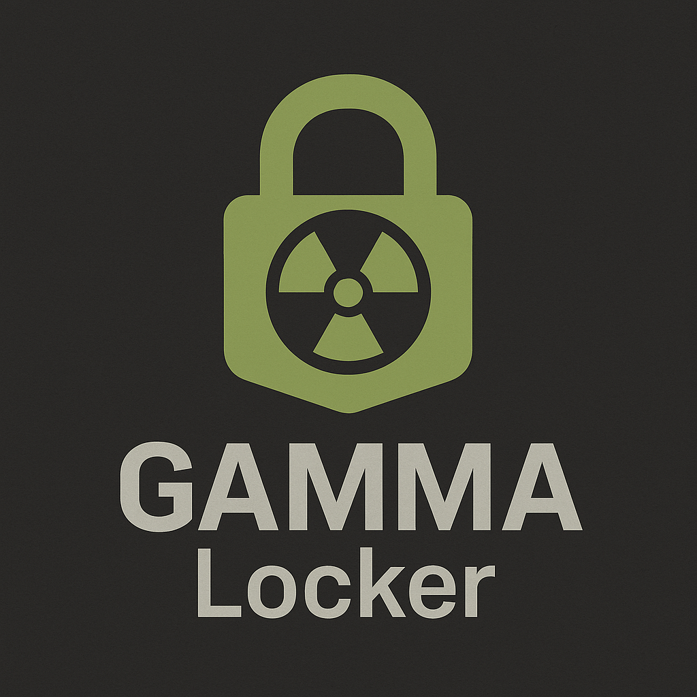
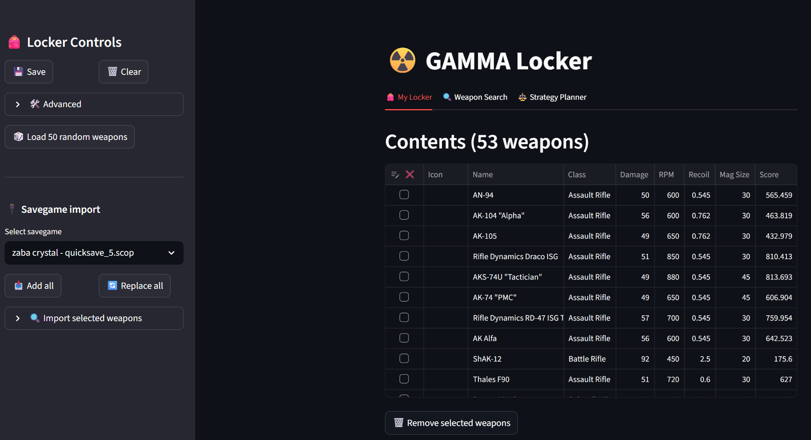
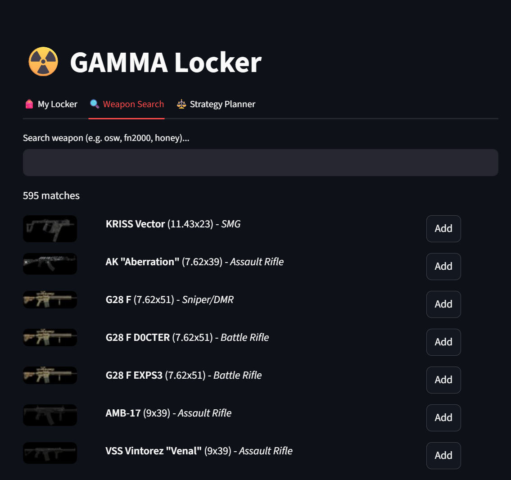
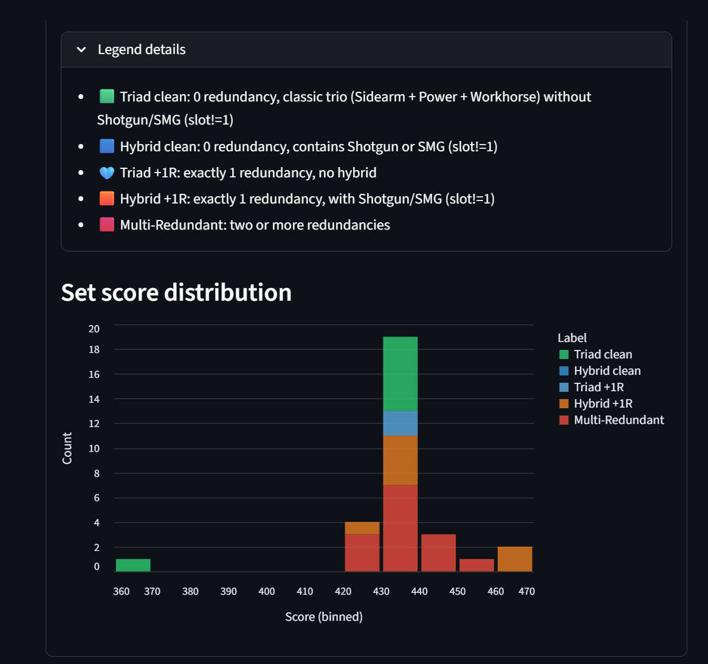
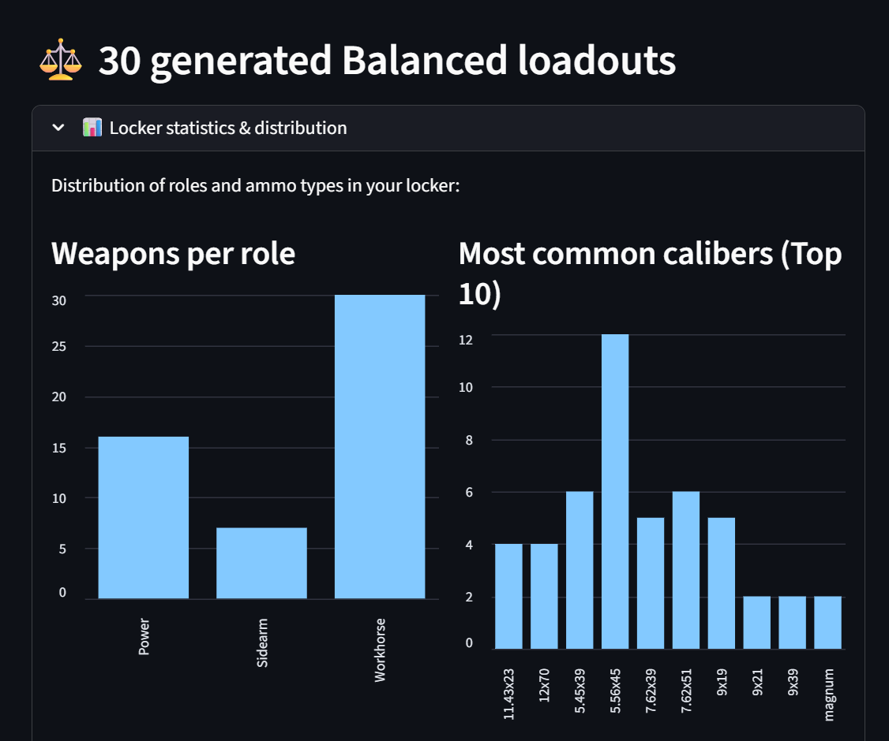
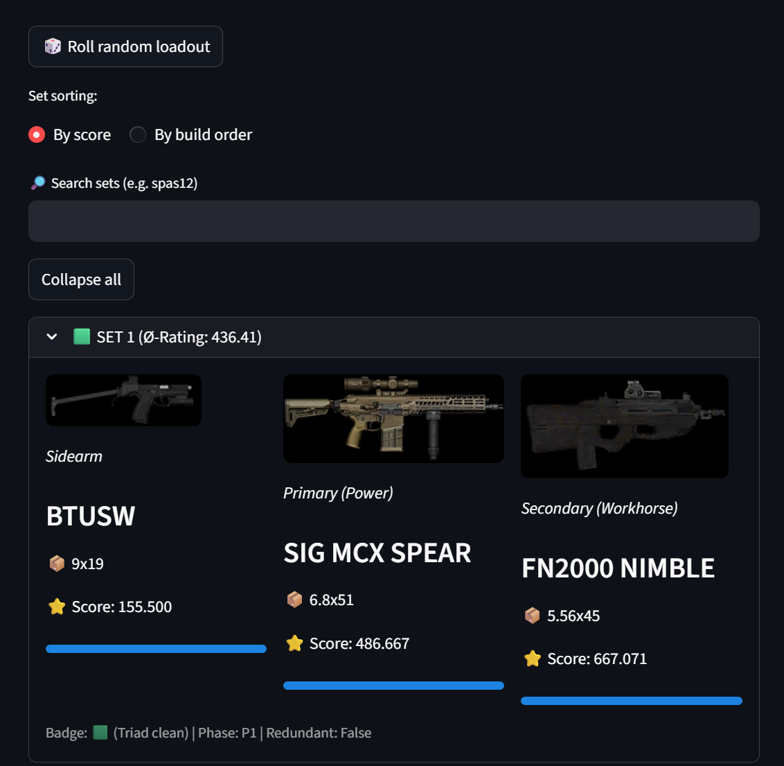

<p align="center">
  
</p>

# GAMMA Locker (Standalone)

GAMMA Locker is a local loadout planner and locker manager for STALKER GAMMA that can parse savegames (`.scop` / `.scoc`) to extract weapon IDs from your run. Depending on what is present in the save data, this can also surface weapons linked to stashes that are not opened yet in normal gameplay.

## Code-Only Distribution (Community Model)

This project is distributed as **code only**.

- We publish Python source code and project configuration.
- Each user generates their own local data/icons by scraping their own GAMMA/MO2 installation.
- Mod assets (DDS textures, extracted icons, etc.) are **not** shipped in releases.

---

## Included Files

- `app.py` – Streamlit web UI (locker, search, strategy planner)
- `save_reader.py` – Savegame parser (`.scop` / `.scoc`)
- `scraper.py` – local data/icon extractor from game/mod files
- `pyproject.toml` – dependencies and project metadata
- `paths_config.json` – central path configuration for app + scraper
- `paths_config.py` – config loader used by app and scraper
- `start_gamma_locker.sh` / `.ps1` / `.bat` – bootstrap launchers (auto-setup + start)
- `docs/branding/*` – logo assets for README/release branding
- `loadout_lab_data/.gitkeep` – placeholder for local runtime data

---

## Features

### Locker Management
- Add/remove weapons
- Bulk removal via checkboxes
- Save/load local locker state
- Backup restore
- Empty-state quick actions (save import + starter random set)

### Savegame Import
- Read savegames from `SAVE_DIR`
- Add-all or replace-all from save
- Selective import
- Can reveal weapon IDs present in save data, including stash-related entries (when present)
- Import summary feedback (`new`, `already present`, `found`)

### Weapon Search
- Multi-keyword search by ID/name
- Preview icons and stats
- Direct add/remove from results
- Melee/knife/axe entries filtered out
- Render limit control + performance hint for large result sets

### Strategy Planner
- Builds strict triad sets:
  - `1 Sidearm`
  - `1 Power`
  - `1 Workhorse`
- Modes: `Balanced` and `Maxxed`
- Phase pipeline (`P1`, `P2H0`, `P1R1`, `P2H1`, `P3`)
- Badge-based hybrid/redundancy classification
- Sorting, set search, random roll

### Icon Handling
- RGBA compositing on black background
- Per-icon R/B swap detection for mixed DDS exports
- Fallback handling for invalid/transparent icons

### Lean UX Helpers
- Startup health check in sidebar (`paths_config.json`, `weapons_stats.csv`, `icons/*.png`)
- Remembered UI defaults (assignment mode, set sorting, set search, search render limit)

---

## Screenshots

### 1) My Locker (start screen)
Shows the locker overview where you manage your current weapon pool.



### 2) Weapon Search
Shows keyword-based search with quick add/remove actions and result stats.



### 3) Set Score Distribution
Histogram of generated set scores to compare quality spread across builds.



### 4) Weapons per Role & Most Common Calibers
Role distribution and caliber frequency charts for your current locker.



### 5) Random Roll Example
Example output after using the random loadout roll in the planner.



### Legal & Asset Credits
- Weapon icons shown in screenshots are game/mod-derived assets from STALKER Anomaly / STALKER GAMMA installations.
- These visuals are displayed for documentation/context only; this repository does not redistribute raw game archives.
- Users should only generate and use icon/data exports from their own legally obtained installation and follow the original game/mod terms.

---

## Requirements

- Python `3.10+`
- Recommended environment: Linux / WSL
- Python packages:
  - `streamlit`
  - `pandas`
  - `numpy`
  - `pillow`
  - `altair`
  - `tqdm`
- Optional for `scraper.py`:
  - ImageMagick (`convert`)

Dependencies are installed automatically by the bootstrap launchers.

---

## First-Time Setup (Required)

### 0) Configure your local paths once

Edit `paths_config.json` and set the paths for your installation:
- `save_dir` → your Anomaly/GAMMA savegames folder
- `scan_paths` → roots to scan for weapon `.ltx` data
- `text_paths` → roots/folders for localization XML files
- `texture_paths` → roots/folders that contain weapon icon `.dds` textures

Both `app.py` and `scraper.py` read this file, so the community only needs to change paths in one place.

Before running the app for real usage, generate local data from your own installation:

```bash
python3 scraper.py
```

This creates local runtime artifacts such as:
- `loadout_lab_data/weapons_stats.csv`
- `loadout_lab_data/icons/*.png`

If these are missing, the app cannot provide meaningful output.

---

## Run GAMMA Locker (Bootstrap Launcher)

From this folder:

### Linux / WSL
```bash
bash start_gamma_locker.sh
```

### Windows (PowerShell)
```powershell
pwsh -File .\\start_gamma_locker.ps1
```

### Windows (double-click)
- Run `start_gamma_locker.bat`

The launcher will:
- create `.venv` if missing
- update `pip`
- install project dependencies
- start Streamlit (`app.py`)

Then open `http://localhost:8501`.

---

## Important Paths to Configure

All user-specific paths are configured in one file:

```json
paths_config.json
```

No code edits are required for normal path setup.

---

## Typical User Flow

1. Run `python3 scraper.py`
2. Start app: `bash start_gamma_locker.sh` (or a Windows launcher)
3. Use **Weapon Search** to build locker
4. Optionally import from savegame
5. Open **Strategy Planner**
6. Choose `Balanced` or `Maxxed`
7. Sort/filter sets and roll random loadouts

---

## Troubleshooting

### App does not start
- Check Python version: `python3 --version` (Linux/WSL) or `py -3 --version` (Windows)
- Re-run the bootstrap launcher

### No savegames detected
- Verify `SAVE_DIR`
- Confirm `.scop`/`.scoc` files exist

### Missing or incorrect icons
- Re-run `python3 scraper.py`
- Modded texture packs can change icon sources; some edge cases may still require manual tweaks

### Slow first load
- Normal with large icon/data sets

---

## Community Release Workflow

- Keep repository code-only
- Do not publish generated `loadout_lab_data` artifacts
- Tag releases with source + docs only

### Download & Verify (SHA256)

Latest release page:
- `https://github.com/phiwi/gamma-locker/releases/latest`

Example (Linux/macOS):

```bash
curl -L -o gamma-locker.zip https://github.com/phiwi/gamma-locker/releases/download/v0.1.2/gamma-locker-0.1.2-code-only.zip
sha256sum gamma-locker.zip
```

Example (PowerShell):

```powershell
Invoke-WebRequest -Uri "https://github.com/phiwi/gamma-locker/releases/download/v0.1.2/gamma-locker-0.1.2-code-only.zip" -OutFile "gamma-locker.zip"
Get-FileHash .\gamma-locker.zip -Algorithm SHA256
```

Expected SHA256 for `v0.1.2`:
- `427fa3493647e2819a451dc0feef40013b7098f0d2c7be0347091d01e10652c5`

---

## Useful Commands

```bash
# Generate local data
python3 scraper.py

# Run app (Linux/WSL bootstrap)
bash start_gamma_locker.sh

# Run app (PowerShell bootstrap)
pwsh -File .\\start_gamma_locker.ps1

# Build release ZIP (Linux/WSL)
bash release.sh

# Build release ZIP (PowerShell)
pwsh -File release.ps1
```
